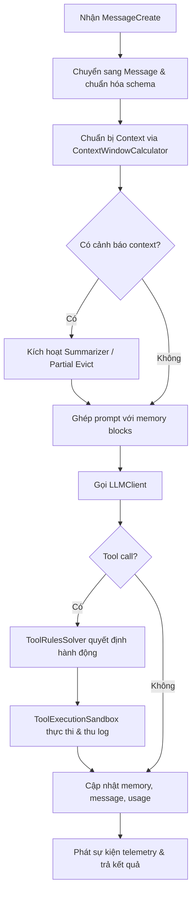
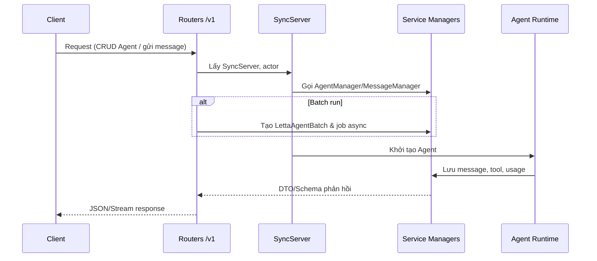

# Logic lõi & hành vi API của Letta

## Tổng quan
Logic cốt lõi của Letta xoay quanh vòng lặp agent có trạng thái, bộ nhớ phân cấp và tập dịch vụ đồng bộ hóa giữa API, job scheduler và công cụ bên ngoài. Các thành phần này đảm bảo agent có thể duy trì hội thoại dài hạn, quản lý tool an toàn và phản hồi ổn định trong giới hạn context.【F:letta/agent.py†L96-L1019】【F:letta/services/context_window_calculator/context_window_calculator.py†L19-L193】

## Vòng đời `Agent.step`
Biểu đồ dưới mô tả chu trình xử lý chính mỗi khi agent nhận tin nhắn mới.

- `Agent.step` nhận danh sách `MessageCreate`, normalize schema rồi gọi `inner_step` để xử lý heartbeat/tool chain.【F:letta/agent.py†L753-L834】
- `ContextWindowCalculator` xác định ngân sách token cho system prompt, memory, summary và message, trả về cấu hình để tạo prompt.【F:letta/services/context_window_calculator/context_window_calculator.py†L63-L193】
- Nếu vượt ngưỡng, `Summarizer` tạo message tóm tắt và cập nhật lại lịch sử, cho phép Partial Evict thay vì xóa dữ liệu quan trọng.【F:letta/agent.py†L945-L1019】【F:letta/services/summarizer/summarizer.py†L27-L199】
- `ToolRulesSolver` quyết định có cho phép gọi tool, có cần heartbeat tiếp theo và quản lý chuỗi hành động nhiều bước.【F:letta/agent.py†L736-L748】
- `ToolExecutionSandbox` khởi chạy môi trường cô lập (local/E2B/Modal) để chạy tool, quản lý dependency, biến môi trường và log an toàn.【F:letta/services/tool_executor/tool_execution_sandbox.py†L37-L200】
- Sau mỗi vòng, agent ghi nhận usage, log, lưu message/tool event qua các manager và phát sự kiện cho batch/job runner.【F:letta/agent.py†L979-L1013】

## Bộ nhớ phân cấp & chiến lược context
Letta duy trì core memory dưới dạng block có metadata, kết hợp với summary/archival memory để cân bằng giữa độ dài hội thoại và ngân sách token.

- `Memory` định nghĩa block có trường `label`, `description`, `character_limit`, `readonly`, `is_file`, giúp LLM đọc/ghi chính xác từng phần thay vì chuỗi đơn.【F:letta/schemas/memory.py†L31-L118】
- `ContextWindowCalculator` tách riêng phần `core_memory`, `summary_memory`, `messages`, `tool_definitions`, giúp hệ thống giám sát và báo cáo chi tiết ngân sách context.【F:letta/services/context_window_calculator/context_window_calculator.py†L131-L193】
- `Summarizer` hỗ trợ nhiều chế độ, bao gồm Partial Evict và Appended Summary. Agent có thể chèn summary vào vị trí index 1 để giữ lại metadata thời gian và bối cảnh chính.【F:letta/services/summarizer/summarizer.py†L98-L199】
- Trước khi trả phản hồi, agent cập nhật usage và warning flags nếu bộ nhớ chạm ngưỡng, đồng thời lưu trạng thái mới để request sau có thể tiếp tục liền mạch.【F:letta/agent.py†L985-L1019】

## Logic API & đồng bộ dịch vụ
Các router FastAPI chia sẻ cùng lớp dịch vụ để giữ logic thống nhất giữa REST, streaming và batch job.

- `app.py` khai báo lifespan khởi động job scheduler, MCP, HTTP client chung và đăng ký router `/v1` cho agent, message, tool, file, v.v.【F:letta/server/rest_api/app.py†L12-L189】
- Router `/agents` cung cấp CRUD, import/export, gửi message, quản lý block/tool/file bằng cách lấy `SyncServer` và ủy quyền cho manager tương ứng.【F:letta/server/rest_api/routers/v1/agents.py†L69-L200】
- Router `/messages` xử lý batch conversation: validate kích thước payload, tạo job async với `LettaAgentBatch`, expose API polling kết quả.【F:letta/server/rest_api/routers/v1/messages.py†L21-L190】
- Managers (như `AgentManager`, `MessageManager`) bao bọc ORM, xử lý transaction, cache, telemetry và phát sự kiện thống nhất cho API lẫn job runner.【F:letta/services/agent_manager.py†L1-L200】

## Điểm khác biệt nổi bật về quản lý bộ nhớ
- **Cấu trúc block giàu ngữ nghĩa**: Core memory theo dạng khối với nhãn/miêu tả giúp LLM hiểu từng phần và cập nhật chính xác – khác với chuỗi lịch sử phẳng của nhiều framework khác.【F:letta/schemas/memory.py†L63-L118】
- **Giám sát ngân sách chi tiết**: ContextWindowCalculator báo cáo chính xác số token của từng loại dữ liệu, hỗ trợ cảnh báo chủ động thay vì chỉ cắt ngắn khi tràn.【F:letta/services/context_window_calculator/context_window_calculator.py†L131-L193】
- **Summarizer chủ động**: Hệ thống tự động tạo summary dựa trên tín hiệu cảnh báo, hỗ trợ partial eviction và chèn summary vào dòng thời gian để duy trì tính liên tục hội thoại dài hạn.【F:letta/agent.py†L945-L1019】【F:letta/services/summarizer/summarizer.py†L114-L199】
