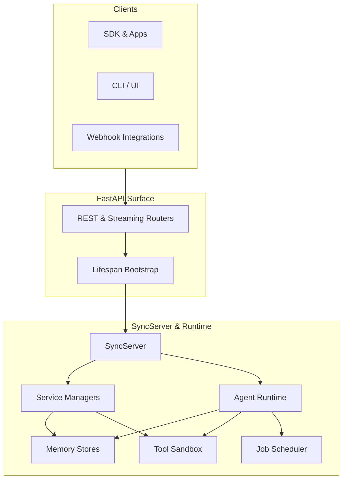
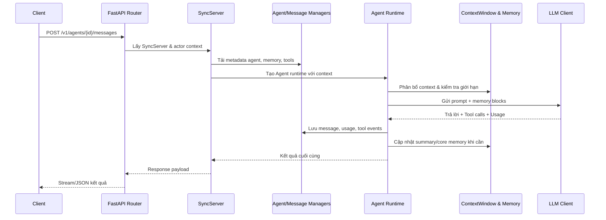

# Tổng quan kiến trúc Letta

## Mục đích
Tài liệu này mô tả kiến trúc tổng quan của Letta – nền tảng xây dựng agent có trạng thái với hệ thống bộ nhớ phân cấp. Kiến trúc được thiết kế để hỗ trợ triển khai đa môi trường (cloud, self-hosted) và mở rộng qua SDK Python/TypeScript.

## Kiến trúc tổng thể
Biểu đồ dưới đây thể hiện các thành phần chính và mối quan hệ của chúng trong một phiên làm việc tiêu chuẩn.

- **FastAPI Routers** khởi tạo trong `letta/server/rest_api/app.py`, gắn các router `/v1` để xử lý agent, message, tool và trả kết quả qua REST/WebSocket.【F:letta/server/rest_api/app.py†L12-L189】【F:letta/server/rest_api/routers/v1/agents.py†L69-L200】【F:letta/server/rest_api/routers/v1/messages.py†L16-L171】
- **SyncServer** quản lý cấu hình hệ thống, khởi tạo các manager và cache LLM/tool, đóng vai trò nhịp tim cho toàn bộ runtime.【F:letta/server/server.py†L117-L199】
- **Service Managers** chịu trách nhiệm tương tác cơ sở dữ liệu, quản lý agent/message/memory/tool một cách thống nhất cho API, scheduler và batch runner.【F:letta/services/agent_manager.py†L1-L200】
- **Agent Runtime** triển khai vòng lặp suy luận, tương tác LLM, điều phối tool và telemetry, duy trì trạng thái hội thoại dài hạn.【F:letta/agent.py†L96-L1019】
- **Tool Sandbox** cung cấp cơ chế thực thi công cụ an toàn (local hoặc từ xa) với quản lý lifecycle và thu thập log.【F:letta/services/tool_executor/tool_execution_sandbox.py†L37-L200】
- **Memory Stores** biểu diễn core memory, summary và block file theo schema giàu metadata giúp agent đọc/ghi chọn lọc.【F:letta/schemas/memory.py†L31-L124】
- **Job Scheduler** khởi động trong lifespan để chạy batch, tác vụ tổng hợp và các job nền khác.【F:letta/server/rest_api/app.py†L122-L189】

## Lượt xử lý API & luồng request
Để minh họa request điển hình gửi tin nhắn tới agent, biểu đồ tuần tự sau mô tả các bước chính.

Luồng này phản ánh các hành vi nổi bật:

1. **Router** chịu trách nhiệm xác thực, ánh xạ payload sang schema và trích xuất `SyncServer` cho từng request.【F:letta/server/rest_api/routers/v1/agents.py†L82-L159】
2. **SyncServer** hợp nhất dữ liệu cấu hình (agent, memory, tools) thông qua các manager và chuẩn bị các client (LLM, MCP, HTTP) dùng chung.【F:letta/server/server.py†L151-L199】
3. **Agent Runtime** thực thi `step`, xử lý heartbeat, tool chain và ghi log telemetry trước khi trả kết quả cho API.【F:letta/agent.py†L753-L1019】
4. **Memory Services** phân bổ token và tự động kích hoạt summarizer nếu context vượt ngưỡng, đảm bảo phản hồi ổn định.【F:letta/services/context_window_calculator/context_window_calculator.py†L19-L193】【F:letta/services/summarizer/summarizer.py†L27-L199】
5. **Service Managers** lưu trữ kết quả, update usage và phát sự kiện cho batch/scheduler để bảo toàn tính nhất quán giữa API và job async.【F:letta/services/agent_manager.py†L1-L200】【F:letta/server/rest_api/routers/v1/messages.py†L171-L190】

## Đặc điểm kiến trúc nổi bật
- **Stateful Agents**: mỗi agent có lịch sử vĩnh viễn, bộ nhớ phân cấp (core, summary, recall/archival) được quản lý bởi services chung.【F:letta/schemas/memory.py†L31-L124】【F:letta/services/context_window_calculator/context_window_calculator.py†L131-L193】
- **Khả năng mở rộng multi-agent**: Shared memory blocks và batch API cho phép nhiều agent cùng truy cập nguồn kiến thức chung, đồng thời hỗ trợ fan-out job.【F:letta/server/rest_api/routers/v1/agents.py†L181-L200】【F:letta/server/rest_api/routers/v1/messages.py†L21-L190】
- **Tooling & Observability**: Sandbox hóa tool, hỗ trợ MCP, batch job và telemetry OTEL giúp tích hợp hệ sinh thái phong phú mà vẫn đảm bảo an toàn và quan sát được.【F:letta/services/tool_executor/tool_execution_sandbox.py†L37-L200】【F:letta/server/server.py†L192-L199】
